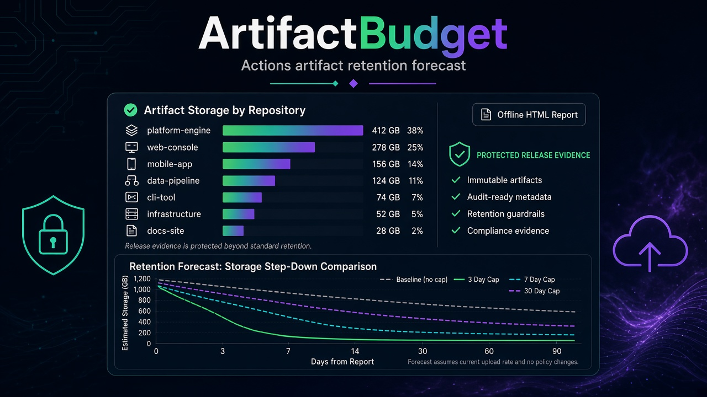

# ArtifactBudget

ArtifactBudget is an offline Python CLI. It turns exported GitHub Actions artifact metadata into a cross-repository inventory and a self-contained HTML retention forecast.

It answers three questions for one snapshot: what is still stored, when is it expected to expire, and how would 3-, 7-, or 30-day retention caps change future storage for that cohort?

The cover above is a close recreation. The original image was not on disk when this repository was built.

## What it will not do

ArtifactBudget does not delete artifacts, download archives, edit workflows, or change GitHub retention, settings, or billing. It does not talk to GitHub. A protection label only excludes an artifact from shortened-retention simulations. It does not extend GitHub retention and it does not preserve the file.

There is no live GitHub adapter in this build. Currency amounts are out of scope. The forecast does not include new uploads, restores, manual deletions, caches, or Packages growth, and it is not an account bill.

## Install

Python 3.11 or newer. The runtime uses the standard library.

```bash
python -m venv .venv
source .venv/bin/activate
pip install -e ".[dev]"
```

`pytest` is only needed to run the tests. The `artifactbudget` command does not need it.

## Demo

From a checkout, with no token and no network:

```bash
artifactbudget validate --manifest examples/manifest.json --policy examples/protection.json
artifactbudget report \
  --manifest examples/manifest.json \
  --policy examples/protection.json \
  --horizon-days 30 \
  --out report/
```

Open `report/report.html` locally. The demo is supposed to show warnings: `demo/mobile-app` is marked incomplete, its exported `total_count` does not match the imported rows, snapshot times span more than 24 hours, one policy id is absent, one artifact has no expiry, and one protected artifact expires within 7 days. That is the point of the sample. A matching count would still not prove an atomic snapshot.

The command refuses to replace an existing report unless you pass `--overwrite`. It writes only these files inside `--out`:

- `report.json`
- `report.html`
- `artifacts.csv`
- `repositories.csv`
- `scenarios.csv`
- `timeline.csv`
- `diagnostics.csv`

## Sample input

Export artifact-list pages yourself. A manifest names the repositories and the files. Paths in `files` are relative to the manifest directory and cannot escape it.

```json
{
  "schema_version": 1,
  "as_of": "2026-10-06T00:00:00Z",
  "repositories": [
    {
      "repository": "demo/alpha",
      "snapshot_at": "2026-10-06T00:00:00Z",
      "complete": true,
      "files": ["alpha-page-1.json"]
    }
  ]
}
```

Each page is a GitHub artifact-list object with `total_count` and `artifacts`. The importer reads `id`, `name`, `size_in_bytes`, `expired`, `created_at`, `expires_at`, and optional `workflow_run` metadata. `size_bytes` is only the internal name. Download URLs are ignored.

Optional protection is exact repository plus artifact id:

```json
{
  "schema_version": 1,
  "protected_artifacts": [
    {"repository": "demo/alpha", "artifact_id": 102, "reason": "Release evidence"}
  ]
}
```

Names and branches are never treated as policy. Unknown policy ids warn. Identical duplicate rows are collapsed and noted. Conflicting duplicates stop the report until you resolve them.

## Commands

```text
artifactbudget validate --manifest examples/manifest.json
artifactbudget report --manifest examples/manifest.json --policy examples/protection.json --horizon-days 30 --out report/
python -m pytest
```

`--as-of` overrides the manifest instant with another timezone-aware timestamp. The default horizon is 30 days. Exit code 0 means no error-level diagnostics. Warnings can still be present. Exit code 1 means the snapshot or the report instant was rejected and nothing was written. Exit code 2 is a usage error.

## Model

The report instant `t0` comes from the manifest `as_of`, or from `--as-of`. Forecast functions do not read the wall clock.

- An artifact is expired at `t0` when `expired` is true or `expires_at` is at or before `t0`. Expired rows are listed and excluded from current retained bytes.
- Missing `expires_at` on a row that is not flagged expired is uncertainty, not zero. Those bytes stay in the current inventory, stay out of the point forecast, and are not shortened by caps. The report shows a lower bound of zero added hours and an upper bound of a full-horizon contribution.
- Baseline expiry is the imported `expires_at`. That is an expected schedule, not a promise about GitHub's deletion processing.
- For an unprotected artifact with a known expiry, an N-day cap uses `min(imported expiry, max(t0, created_at + N days))`.
- Protected artifacts keep the baseline expiry under every cap. A cap never lengthens retention.
- If `created_at + N days` is at or before `t0`, the scenario simulates the artifact leaving at `t0`. The report calls that a hypothetical immediate removal. The tool does not delete anything, and the current-inventory total does not change.
- Retained modeled bytes at time `t` are sizes whose effective expiry is strictly later than `t`. At the exact expiry timestamp the artifact no longer contributes.
- Future storage over `[t0, t0+H)` is `size_bytes * seconds / 3600`, using exact byte-seconds. `H` defaults to 30 days of 86400 seconds.
- Reduction is baseline minus that scenario for the known-expiry cohort. It is not a refund.

Display:

- Bytes are exact.
- GiB and GiB-hours divide by 1,073,741,824 (`2^30`). GiB-hours are labeled as equivalent to GitHub's documented binary GB-hours.
- Decimal GB, when shown, is `bytes / 1,000,000,000` and is never a billing input.
- There is no GB-month conversion and no price.

Age buckets for retained artifacts are half-open: under 1 day, 1–7 days, 7–30 days, 30–90 days, and 90 days or more.

### Hand-calculated cohort

`tests/fixtures/abc/` pins one cohort at `t0` over a 7-day horizon:

| Artifact | Size | Age at t0 | Expires in | Protection |
| --- | --- | --- | --- | --- |
| A | 1 GiB | 10 days | 20 days | unprotected |
| B | 0.5 GiB | 2 days | 5 days | protected |
| C | 0.25 GiB | 1 day | 6 days | unprotected |

Current inventory is 1.75 GiB under every cap. Baseline storage is 264 GiB-hours. A 3-day cap is 72, a 7-day cap is 96, and a 30-day cap is 264. B keeps its 5-day expiry in every scenario. A is already older than 3 and 7 days, so those caps simulate it leaving at `t0`.

## Assumptions and limits

The HTML report prints the full assumption list. In short:

- Only repositories and pages named by the manifest are in scope.
- `complete: true` is the manifest's assertion. A `total_count` match does not prove the export is complete or atomic.
- Snapshot times more than 24 hours apart are flagged.
- An artifact created after `t0` makes that report instant invalid.
- The same artifact id in two repositories is two rows. The composite key is repository plus id.
- Imported text is untrusted. HTML is escaped. CSV formula prefixes (`=`, `+`, `-`, `@`, tab, carriage return) are neutralized in text cells.
- Input SHA-256 hashes and the tool version are recorded. Reports do not include the wall-clock generation time, so the same inputs produce the same files.

## Sources

Facts used for units and for the decision not to invent a bill, checked for this offline MVP on October 6, 2026:

- [GitHub artifact REST API](https://docs.github.com/en/rest/actions/artifacts): `size_in_bytes`, `created_at`, `expires_at`, `expired`, artifact id. List responses are paginated. The documented fine-grained permission is Actions read; repository authorization still applies. This MVP does not call the API.
- [GitHub Actions billing](https://docs.github.com/en/billing/concepts/product-billing/github-actions): storage accrues hourly, Actions artifacts and Packages share a pooled allowance, cache allowance is separate, and the billing gigabyte is `2^30` bytes. Current storage and already-accrued billing are different. This snapshot is not that bill.

## Development

```bash
pip install -e ".[dev]"
python -m pytest
```

The acceptance fixture and the other required edge cases live under `tests/`. Modules:

| Module | Role |
| --- | --- |
| `artifactbudget/importer.py` | Parse, validate, deduplicate, provenance |
| `artifactbudget/policy.py` | Exact protection matching |
| `artifactbudget/forecast.py` | Clock-free retention math |
| `artifactbudget/report.py` | JSON, CSV, and HTML |
| `artifactbudget/cli.py` | `validate` and `report` |

Export files are opened read-only. Output names are fixed. Symlinked output paths are refused.
